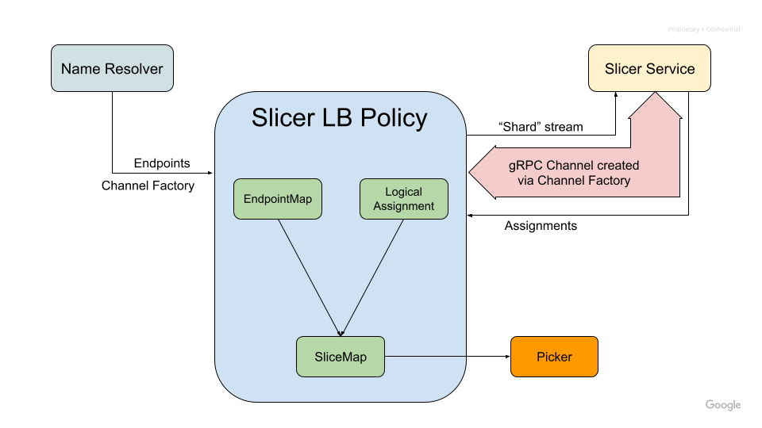
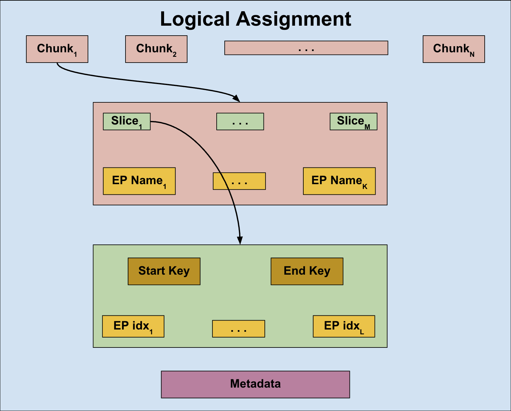

A119: Slicer LB Policy
----
* Author: easwars
* Approver: markdroth
* Implemented in: TBD
* Last updated: 2026-07-27
* Discussion at: TDB

## Abstract

Add support for a sharding load balancing policy, that communicates with an
external sharding service to receive resource assignments. This policy should be
supported in both xDS and non-xDS based deployments.

## Background

An auto-sharding service enables client-side load balancing through the
following process:

* Dividing the keyspace into distinct, non-overlapping ranges (or slices)
* Assigning specific resources to these key ranges
* Adjusting these mappings in real-time to account for resource availability and
  fluctuating load
* Gathering load metrics for keys within an application-defined keyspace

Within this framework, application-defined keys generally consist of arbitrary
byte sequences, such as:

* Individual User IDs or Project IDs
* Tenant identifiers for multi-tenant architectures
* Identifiers created via hashing

The targets for traffic distribution, or resources, frequently include:

* Application servers
* Kubernetes pods within a cluster

Implementing a load balancing policy in gRPC that uses an auto-sharding service
has applications in various scenarios, such as:

* Enhancing request affinity in stateful environments
* Improving isolation and system resilience for multi-tenant services
* Providing the scalability required for rapid growth in AI-driven applications

### Related Proposals

* [A42: xDS Ring Hash LB Policy][A42]
* [A52: gRPC xDS Custom Load Balancer Configuration][A52]
* [A62: Pick First][A62]
* [A74: xDS Config Tears][A74]
* [A75: xDS Aggregate Cluster Behavior Fixes][A75]
* [A78: gRPC OTel Metrics for WRR, Pick First, and XdsClient][A78]
* [A102: xDS GrpcService Support][A102]
* [A121: RPC Delay Observability][A121]
* [OSS DynamicSharding gRPC Protocol Spec](TBD)

## Proposal

Add the `slicer_experimental` LB policy in gRPC that contains the following
functionality:

* Utilizing the OSS DynamicSharding gRPC protocol for communicating with a
  sharding service and processing assignments from that service.
  * These assignments will partition an application-defined keyspace into
    distinct, non-overlapping key-ranges or slices, each associated with a set
    of server endpoints.
* Mapping client application requests to a specific key within the
  application-defined keyspace.
* Identifying the matching key-range and choosing a server endpoint assigned to
  it.
* Providing a fallback mechanism to route client traffic when assignments from
  the sharding service are unusable.

Crucially, the LB policy receives its configuration and endpoint data from the
Name Resolver and not from the sharding service.

### LB Policy Architecture



The LB policy receives the following information from the Name Resolver apart
from its configuration:

* A set of endpoints where each endpoint may include an optional hostname
  attribute. If this attribute is missing, the first address associated with the
  endpoint shall serve as the hostname.
* A "Channel Factory" that returns a fully functional gRPC Channel to the
  sharding service, given an opaque string specified in the configuration

The endpoints are stored in a map where the key is the hostname of the endpoint,
and the value is the state associated with the endpoint. This state includes a
`pick_first` child policy LB policy, and the most recent connectivity state and
picker returned by that policy. We'll call this map the `EndpointMap` going
forward. In Go, this could look like this:

```golang
type endpointMap struct {
  m map[string]endpointState
}

type endpointState struct {
  childLB balancer.Balancer
  state   connectivity.State
  picker  balancer.Picker
}
```

The LB policy must use the injected "Channel Factory" to create a gRPC channel
to the sharding service, and must create a `Shard` stream on it. The sharding
service will send assignments on this stream. These will be stored internally in
a data structure named `LogicalAssignment`, and will contain key-ranges and
their associated endpoint names. In Go, this could look like this:

```golang
type logicalAssignment struct {
 slices        []slice
 endpointNames []string
 generation    int64
}

type slice struct {
 startKey  []byte // Inclusive
 endKey    []byte // Exclusive, nil for sentinel
 endpoints []int  // Index into logicalAssignment.endpointNames
}
```

`EndpointMap` and `LogicalAssignment` are combined into a data structure name
`SliceMap`, which is optimized for lookups. Given a key, it returns a matching
key-range. The `SliceMap` must be immutable, allowing the Picker to access it
without any explicit synchronization with the LB policy.

In Go, the `SliceMap` could look like this:

```golang
 type sliceMap struct {
  slices       []sliceEntry      // Sorted by startKey
  allEndpoints []endpointState   // State of all endpoints across the assignment
  fallbackPool assignedEndpoints // Precomputed indices & state buckets for all endpoints combined
  generation   int64
 }
  
 type sliceEntry struct {
  startKey      []byte
  endpointsPool assignedEndpoints
 }
  
 type assignedEndpoints struct {
  allEndpointsInSlice []int    // Indices into sliceMap.allEndpoints
  endpointsByState    [5][]int // Array indexed directly by connectivity.State (ranges 0..4)
  inFallback          bool
 }
```

Because assignments are pre-validated to have no gaps and cover the full key
range, and since `slices` is sorted by `startKey`, the implementation of
`sliceMap.lookup` boils down to a binary search to find the smallest index `i`
where `slices[i].startKey > key`. Once we have `i`, index `i - 1` is what we are
actually looking for. Here is a psuedo-code for it:

```golang
func Lookup(key) sliceEntry:
  // Total fallback case where LB policy does not have usable assignments.
  if empty(sliceMap.slices):
      return nil

  // Binary search for key comparing against sliceEntry.startKey.
  // BinarySearch returns:
  // - found = true  if slices[idx].startKey == key
  // - found = false if key is not an exact startKey match;
  //           idx is the first slice where slices[idx].startKey > key
  (idx, found) = BinarySearch(sliceMap.slices, key, by startKey)

  // Exact match on startKey ([startKey, nextStartKey)).
  if found:
      return sliceMap.slices[idx]

  // Key falls inside the range [slices[idx - 1].startKey, slices[idx].startKey).
  return sliceMap.slices[idx - 1]
```

#### Building the SliceMap

The `SliceMap` is generated from the `EndpointMap` and `LogicalAssignment` when
either of them change. Here is the pseudo-code for the logic to build the
`SliceMap`:

```text
function NewSliceMap(endpointMap, logicalAssignment):
  sliceMap = new SliceMap()

  // No logical assignment received yet. Initialize for total fallback.
  if logicalAssignment is nil: 
      for each (name, state) in endpointMap:
          sliceMap.allEndpoints.append(state)
      sliceMap.fallbackPool = GroupByConnectivityState(all indices in sliceMap.allEndpoints)
      return sliceMap

  // Endpoints mentioned in the assignment that are missing from endpointMap are
  // skipped.
  validIndices = bitmap of size len(logicalAssignment.endpointNames) initialized to false
  fallbackIndices = []

  // Align slots 0 .. N-1 with logicalAssignment.endpointNames so slice index
  // references match.
  for i = 0 to len(logicalAssignment.endpointNames) - 1:
      name = logicalAssignment.endpointNames[i]
      if name exists in endpointMap:
          sliceMap.allEndpoints[i] = endpointMap[name]
          validIndices[i] = true
          fallbackIndices.append(i)

  // Append resolver endpoints not mentioned in logicalAssignment to
  // allEndpoints so fallbackPool includes 100% of endpoints provided by the
  // Name Resolver.
  for each (name, endpointState) in endpointMap:
      if name not in logicalAssignment.endpointNames:
          fallbackIndices.append(len(sliceMap.allEndpoints))
          sliceMap.allEndpoints.append(endpointState)

  // Precompute fallback candidates grouped by connectivity state
  sliceMap.fallbackPool = GroupByConnectivityState(fallbackIndices, sliceMap.allEndpoints)

  // Build slice entries (assumed pre-sorted in the logicalAssignment)
  for each slice in logicalAssignment.slices:
      validSliceEndpoints = filter slice.endpoints keeping only indices where validIndices[idx] == true
      sliceMap.slices.append(SliceEntry{
          startKey:  slice.startKey,
          endpoints: GroupByConnectivityState(validSliceEndpoints, sliceMap.allEndpoints)
      })

  return sliceMap

function GroupByConnectivityState(indices, allEndpoints):
  assigned = AssignedEndpoints{
      allEndpointsInSlice: indices,
      endpointsByState:    array of 5 empty lists  // O(1) direct slot access, no hash map
  }

  for each idx in indices:
      state = allEndpoints[idx].state              // e.g., Ready (2)
      assigned.endpointsByState[state].append(idx)

  // Marked inFallback=true if it has zero valid endpoints or if all of its
  // assigned endpoints are in TRANSIENT_FAILURE.
  allTF = (len(indices) > 0) and (len(assigned.endpointsByState[TransientFailure]) == len(indices))
  assigned.inFallback = (len(indices) == 0) or allTF

  return assigned
```

### Fallback Mechanism

The LB policy must support a fallback mechanism that utilizes all endpoints
provided by the Name Resolver. There are two types of fallback:

* Per-slice fallback:
  * This happens when the LB policy contains valid endpoints and assignments,
    but all endpoints in the matching `SliceEntry` for an RPC are in
    `TRANSIENT_FAILURE`.
* Fallback at startup (see [section](#fallback-at-startup) for more details):
  * This happens when the following conditions are met:
    * No valid assignments have been received from the sharding service, and,
    * Initial assignment timer has expired

Key considerations here:

* The LB policy must employ the fallback mechanism only when enabled in the LB
  policy configuration.
* The LB policy must consider all available endpoints during fallback and must
  not employ any sort of subsetting.
* The LB policy must continue using previously received good assignments from
  the sharding service, if it subsequently receives a bad one or if the
  connection to the sharding service fails.

#### Fallback at startup

Whenever the LB policy creates a new gRPC channel to the sharding service, it
must start a timer for the duration specified by the
`initial_assignment_timeout` field in the LB policy configuration. RPCs must
remain queued until one of the following events occurs, at which point the
policy builds a `SliceMap` and updates the gRPC Channel with a new `Picker`,
which then retries the queued RPCs:

* A valid assignment is received from the sharding service
  * The new `Picker` uses this assignment for the retried RPCs.
  * If the LB policy hasn't received endpoints from the Name Resolver yet, RPCs
    will fail until endpoints are received.
* The timer expires
  * If fallback is enabled: RPCs are routed at random to all endpoints provided
    by the Name Resolver.
  * If fallback is disabled: RPCs fail until a valid assignment is received.

While RPCs are queued waiting for one of the above events to happen, the
`Picker` must set `delay_type` to "slicer_assignment_pending". See [WIP gRFC
A121][A121].

### Supported modes of operation

The LB policy must support two primary modes of operation:

* An LB policy that performs both locality and endpoint picking:
  * In xDS use-cases, such an LB policy receives endpoints across all
    localities and shards requests accordingly. This is similar to how the
    `ring_hash` LB policy, specified in [gRFC A42][A42], works.
  * In non-xDS use-cases, such an LB policy will be configured as the top-level
    LB policy, sharding requests across a flat list of endpoints provided by the
    Name Resolver.
* An LB policy that only performs endpoint picking:
  * In xDS use-cases, such an LB policy will be configured under a policy like
    `weighted_target_experimental` that handles locality picking, while each
    `slicer_experimental` child policy instance only handles endpoint picking
    within its specific locality.

The LB policy must maintain consistent behavior across both modes and must not
require explicit knowledge of its operational context. Notably, we do not
support using this LB policy solely for locality picking with delegation to a
separate endpoint-picking policy. This configuration lacks identified use cases
and introduces significant implementation complexity.

### Load Balancing Configuration

The `slicer_experimental` LB policy's configuration will be as follows:

```proto
message SlicerLbConfig {
 // Key to pass to the "Channel Factory" to create a gRPC Channel to the
 // sharding service.
 string channel_factory_key = 1;

 // A unique ID sent to the sharding service to locate assignments.
 //
 // Can optionally contain a "%s" token that will be replaced with the
 // "Locality" before sending. If a "%s" token is present, but the "Locality"
 // information is not available to the LB policy, the token will be replaced
 // with an empty string.
 string slicing_target = 2;

 // Name of the request header containing the application-defined key. This key
 // is used to look up the matching key-range assigned by the sharding service.
 string slice_key_header_name = 3;

 // If true, fallback mechanism is enabled.
 bool enable_fallback = 4;

 // How long to wait for the initial assignment from the sharding service. If
 // no assignment is received before the timer fires, the LB policy  will either
 // go into fallback mode (if enable_fallback is true) or fail RPCs.
 // Defaults to 60 seconds if not specified.
 google.protobuf.Duration initial_assignment_timeout = 5;
}
```

Key considerations regarding the LB policy configuration that must be handled by
the "Channel Factory".

* The configuration deliberately omits credentials to be used for the
  communication with the sharding service. This decision prevents potential
  privilege-escalation vulnerabilities resulting from a compromised control
  plane, following the security framework established in [gRFC A102][A102].
* Per-request gRPC metadata for the sharding service is omitted from the
  configuration.

### Handling updates from the Name Resolver

When the LB policy receives a configuration update, it must do the following:

* If the `channel_factory_key` field has changed (or if this is the
  first configuration update), use the “Channel Factory” to [create a new gRPC
  channel to this target URI](#creating-a-grpc-channel-to-the-sharding-service).
  If a new gRPC channel is created:
  * Create a new `Shard` stream on the newly created gRPC channel, and,
  * Close the previously created gRPC channel to the sharding service
* If the `slicing_target` field has changed, create a new `Shard` stream because
  the `slicing_target` controls the assignments sent by the sharding service.

When the LB policy receives endpoints from the Name Resolver, it must do the
following:

* Create a `pick_first` child, lazily, for every endpoint. The latter will create
  subchannels for the addresses within the endpoints. See [this
  section](#interactions-with-pick_first) for more details.
* Update the `EndpointMap` accordingly.
* Build a new `SliceMap` unless the initial assignment timer is active. See
  section [Building the SliceMap](#building-the-slicemap) for more information.
  * Build a new `Picker` that uses the above `SliceMap`.

If the LB policy receives an empty set of endpoints from the Name Resolver, it
must set the connectivity state of the gRPC channel to `TRANSIENT_FAILURE` and
fail all subsequent RPCs until an update with a non-empty set of endpoints is
received.

### Creating a gRPC Channel to the Sharding Service

The LB policy will be injected with a “Channel Factory” via attributes,
alongside its configuration. This utility will help create a fully functional
gRPC Channel given the `channel_factory_key` in the LB policy configuration.
Implementations must ensure the key uniquely encodes all parameters necessary
for channel creation. For example, credentials need only be included in the key
if the factory supports creating channels with different credentials.

In xDS-based deployments, this “Channel Factory” will be injected by the
`cds_experimental` LB policy. Refer to section [Changes to CDS LB
policy](#changes-to-cds-lb-policy) for more details. For non-xDS environments,
users will have the capability to inject this utility via a dedicated channel
option.

#### Go

The “Channel Factory” or provider is defined as a function type that accepts the
a string, and returns a gRPC channel. The existing `grpc.ClientConnInterface`
interface, instead of the concrete `*grpc.ClientConn` type,  is used to
represent a gRPC channel, to allow for wrapping. The LB policy can create a
client stub to the sharding service by passing this interface to the protobuf
generated code and make RPCs using that client stub.

```golang
package grpc

// A factory to create a grpc.ClientConn given a string. 
//
// The second return value is a cancel function that the caller must invoke
// once they are done using the returned grpc.ClientConn. 
type ClientConnProvider func(string) (ClientConnInterface, func(), error)
```

A `DialOption` will be added to allow the user to inject a “Channel Factory”.
gRPC will take care of plumbing this down to the LB policies.

```golang
package grpc

// WithClientConnProvider returns a dial option that makes the channel provider
// available to LB policies.
func WithClientConnProvider(f ClientConnProvider) DialOption { ... }
```

We will also have APIs to set and get this factory from the `resolver.State`
struct that is sent to the LB policy as part of a resolver update.

```golang
package grpc

// ClientConnProviderFromResolverState returns a ClientConnProvider from the
// given resolver state, or nil if not present.
func ClientConnProviderFromResolverState(state resolver.State) ClientConnProvider { ... }

// SetClientConnProvider returns a copy of the resolver state with the provider
// set as an attribute.
func SetClientConnProvider(s resolver.State, p ClientConnProvider) resolver.State { ... }
```

#### C++

TBD

#### JAVA

TBD

### Communicating with the sharding service

The LB policy communicates with an external sharding service using the OSS
DynamicSharding gRPC protocol. As described earlier, the LB policy creates a
gRPC channel to the sharding service using the “Channel Factory” provided to it,
whenever the `channel_factory_key` in its configuration changes. It will
then create a `Shard` stream on that channel.

#### Sending the first message

The LB policy sends an `Init` message on the stream to kick things off. This
message currently contains three fields:

* `target`: The value for this field is derived from the `slicing_target` field
  of the LB policy configuration. If a `%s` tokens is present in this string, it
  is replaced with the “Locality” value  passed to the LB policy as attributes
  in the resolver update (similar to how the “Channel Factory” is passed).
  * In xDS use-cases, the “Locality” value is currently populated by the
    `weighted_target_experimental` LB policy as a resolver state attribute, and
    is available to all LB policies that sit underneath it.
    * When the `slicer_experimental` LB policy is used for endpoint picking
      alone, it will sit underneath the `weighted_target_experimental` LB
      policy, and therefore will have access to this resolver attribute. See
      [gRFC A78][A78] for more details.
    * When the `slicer_experimental` LB policy is used for both locality and
      endpoint picking, the “Locality” value will not be part of the slicing
      target as the policy will handle endpoints from all localities.
  * In non-xDS use-cases, the common case is for the `slicing_target` to not
    contain `%s` tokens. But if they do, it is the responsibility of the user to
    ensure that this attribute is populated by the Name Resolver. If this
    attribute is not available, the LB policy will replace the `%s` token with
    an empty string.
* `client_uuid`: The LB policy generates a UUID at creation time and must reuse
  the same value across stream restarts.
* `current_generation`: The LB policy must store the generation number of the
  most recent good assignment received from the sharding service and use that
  value here.
  * This allows the sharding service to not resend a previously sent good
    assignment in the case of a stream failure.

#### Handling responses from the sharding server

Responses received from the sharding server in a `ShardingResponse` message can
one of the following:

* `AssignmentChunk`: This contains one chunk of a logical assignment from the
  sharding server. The LB policy must cache chunks until it receives an
  `AssignmentMetadata` message.
* `AssignmentMetadata`: This indicates the end of a logical assignment from the
  sharding server. The LB policy must attempt to combine previously received
  chunks into one single logical assignment.
* `LoadReportingConfig`: This contains configuration for how load needs to be
  aggregated and sent to the sharding server. The LB policy must ignore this
  message for the time being.

See section on [Handling assignments from the sharding
server](#handling-assignments-from-the-sharding-server) for more information.

#### Backoff on stream and connectivity failures

When a `Shard` stream fails without receiving at least one good logical
assignment, the LB policy must use exponential backoff before each successive
attempt to re-establish the stream. The algorithm should be similar to what gRPC
uses for connection attempts. The backoff state will be reset when a `Shard`
stream finally receives a good logical assignment from the server. If there are
no previously received assignments, the LB policy must use the fallback option
described in the section [Fallback mechanism](#fallback-mechanism) section.

#### Handling assignments from the sharding server

The sharding server implementing the OSS DynamicSharding gRPC protocol will
distribute (chunked) complete assignments to its clients, instead of deltas.
From the LB policy’s point of view, this will look as follows:

* A single logical assignment is split into multiple `ShardingResponse` messages
* Each `ShardingResponse` message contains either an `AssignmentChunk` message
  or an `AssignmentMetadata` message.
* Each `AssignmentChunk` message contains a list of `SliceAssignment` messages
  and a list of `EndpointState` messages:
  * Each `SliceAssignment` message contains a `Slice` that contains a
    `[start_key, end_key)` and a list of endpoint indices into the combined
    endpoint list over all chunks (in chunk order).
  * Each `EndpointState` message contains a single endpoint name.
* The `AssignmentMetadata` message indicates that the sharding server has
  completed sending all chunks for the current assignment and contains a
  generation number for the logical assignment.

Visually, we can represent this as follows:



The LB policy must cache the `AssignmentChunk` messages locally until it sees an
`AssignmentMetadata` message. This is because each `Chunk` contains several
endpoint names and each `Slice` within a chunk contains an index into the
complete set of endpoint names, combined in chunk order. So, until all chunks
are received, the LB policy cannot meaningfully use any of them.

Once the `AssignmentMetadata` message is received, the LB policy must build a
new `SliceMap`. If building the `SliceMap` fails, the LB policy must terminate
the stream to the sharding service, and attempt to re-establish it.

Once a `SliceMap` is built successfully, the LB policy must create a new picker
with the newly built `SliceMap` and send an update to the gRPC channel.

### The Picker

The LB policy must create a new picker every time a new `SliceMap` is built. The
picker is given the `SliceMap` and the `slice_key_header_name` field from the LB
policy configuration, from which it can extract the key for the incoming
request. When constructing the picker, if there is at least one endpoint in
CONNECTING state, the LB policy must set the `hasEndpointInConnectingState`
field of the picker to `true`.

Here is the pseudo-code for the `Pick` method of the picker:

```text
function Pick(info):
  // Extract the key from the request header.
  key = ExtractKeyFromMetadata(info, slice_key_header_name)

  // Lookup the matching key-range.
  sliceEntry = sliceMap.Lookup(key)

  // No assignment exists for this key. This can only happen if no good
  // assignments have been received from the sharding service.
  if sliceEntry is nil:
    if fallback_enabled:
      return PickFromAssignedEndpoints(sliceMap.fallbackPool, info)
    else
      return PICK_FAILED


  // Matching key-range is in fallback mode.
  if sliceEntry.endpointsPool.inFallback and fallback_enabled:
      return PickFromAssignedEndpoints(sliceMap.fallbackPool, info)

  // Delegate to matching key-range. In per-slice fallback cases, this will
  // yeild a better error message.
  return PickFromAssignedEndpoints(sliceEntry.endpointsPool, info)


// Picks an endpoint from the pool, which is of type `assignedEndpoints`.
function PickFromAssignedEndpoints(pool, info):
  // Queue the pick when no endpoints exist in this pool. This happens when Name
  // Resolver update trails assignments.
  if empty(pool.allEndpointsInSlice):
    // TODO: Do we need a new delay_type here?
    return PICK_QUEUE

  // Pick a random endpoint within the slice.
  firstIndex = PickRandomIndex(pool.allEndpointsInSlice)

  // Loop through all endpoints in the slice starting at the above random index,
  // and delegate to the first READY endpoint. If there is no endpoint in
  // CONNECTING state, request a connection on the first IDLE endpoint.

  requestedConnection = picker.hasEndpointInConnectingState
  for i = 0 to len(pool.allEndpointsInSlice) - 1:
    // Find the actual endpoint from the SliceMap.
    index = (firstIndex + i) % len(pool.allEndpointsInSlice);
    ep = sliceMap.allEndpoints[pool.allEndpointsInSlice[index]];

    if ep.state == READY:
      return ep.picker.Pick(info)
    if !requested_connection && ep.state == IDLE:
      ep.childLB.ExitIdle()
      requestedConnection = true

  // If we did not find any READY endpoints, but requested connection on an IDLE
  // endpoint, queue the pick.
  if requestedConnection:
    // Set delay_type to "connecting".
    return PICK_QUEUE

  // All children are in transient failure. Return the first failure.
  ep = sliceMap.allEndpoints[pool.allEndpointsInSlice[firstIndex]];
  return ep.picker.Pick(info)
```

### Interactions with `pick_first`

The LB policy will not proactively connect to endpoints given to it by the Name
Resolver. Instead, connections are triggerred from the picker as described above
in the picker pseudo-code. `slicer_experimental` must create a `pick_first`
child for every endpoint given to it by the Name Resolver. `pick_first` starts
connecting as soon as it is given its endpoint. So, `slicer_experimental` must
make sure that the child `pick_first` policy is created lazily, when a
connection to that endpoint needs to be established. This may be accomplished by
wrapping `pick_first` in a parent policy that creates `pick_first` only when
asked to establish a connection.

The `slicer_experimental` LB policy also relies on the sticky-TF behavior
(specified in [gRFC A62][A62]) implemented by the `pick_first` policy, that
ensures endpoints in `TRANSIENT_FAILURE` stay in that state and continuously try
to reconnect with exponential backoff until they become `READY`.

### Aggregated Connectivity State

The LB policy will use the same rules used by the `ring_hash` LB policy, as
described in [gRFC A42][A42] to determine the aggregated connectivity state of
the gRPC Channel. The complete connectivity state aggregation rules are as
follows:

1. If there is at least one subchannel in `READY` state, report `READY`.
2. If there are 2 or more subchannels in `TRANSIENT_FAILURE` state, report
   `TRANSIENT_FAILURE`.
3. If there is at least one subchannel in `CONNECTING` state, report
   `CONNECTING`.
4. If there is one subchannel in `TRANSIENT_FAILURE` and there is more than
   one subchannel, report state `CONNECTING`.
5. If there is at least one subchannel in `IDLE` state, report `IDLE`.
6. Otherwise, report `TRANSIENT_FAILURE`.

Because the LB policy etablishes connections lazily in response to RPCs, it
starts off in `IDLE` and not `CONNECTING`, list most other LB policies. The LB
policy uses a heuristic and reports `TRANSIENT_FAILURE` when at least two
subchannels are in `TRANSIENT_FAILURE` and none of the subchannels are `READY`.
This heuristic is an attempt to to balance the need to allow the `priority`
policy to quickly failover to the next priority and the desire to avoid
reporting the entire policy as having failed when the problem is just one
individual subchannel that happens to be unreachable.

When the LB policy receives an connectivity state update from any of its child
policies or receives a resolver update and computes the aggregated connectivity
state that turns out to be `TRANSIENT_FAILURE` or `CONNECTING`, it must ensure
that there is at least one subchannel that is actively trying to connect, giving
itself a chance to move to `READY` even when it is not receiving any picks. One
possible implementation of this is shown in the following pseudo-code:

```text
if aggregatedConnectivityState is CONNECTING or TRANSIENT_FAILURE:
  if num(endpoints in CONNECTING) == 0:
    if num(endpoints in IDLE) != 0:
      Find a random endpoint in IDLE and connect to it.
```

An efficient way to implement the above algorithm is to keep track of the first
IDLE endpoint while iterating through all endpoints to determine the aggregated
connectivity state.

### xDS integration

In order to use the `slicer_experimental` policy in xDS use-cases, we will
define a protobuf message that represents the configuration for this policy in
the Envoy xDS repo. The xDS management server will then make use of the
[load_balancing_policy](https://github.com/envoyproxy/envoy/blob/d26361ac44e48ad347afbaff141c5c0387d48c40/api/envoy/config/cluster/v3/cluster.proto#L1229)
field of the
[Cluster](https://github.com/envoyproxy/envoy/blob/d26361ac44e48ad347afbaff141c5c0387d48c40/api/envoy/config/cluster/v3/cluster.proto#L50)
resource appropriately.

As mentioned in the [Supported modes of
operation](#supported-modes-of-operation) section, client applications can be
configured to use the `slicer_experimental` LB policy for both locality and
endpoint picking, by setting the `load_balancing_policy` field to an instance of
the `Slicer` protobuf message described in the next section. To use the
`slicer_experimental` LB policy *only* for endpoint picking, the
`load_balancing_policy` field could be set to a locality picking policy like
[WrrLocality](https://github.com/envoyproxy/envoy/blob/d26361ac44e48ad347afbaff141c5c0387d48c40/api/envoy/extensions/load_balancing_policies/wrr_locality/v3/wrr_locality.proto#L21)
and setting the `endpoint_picking_policy` field inside it to the `Slicer`
protobuf message described below.

#### xDS LB policy configuration

A new message type that represents the configuration for the
`slicer_experimental` LB policy will be added to the envoy repository in the
[api/envoy/extensions/load_balancing_policies](https://github.com/envoyproxy/envoy/tree/main/api/envoy/extensions/load_balancing_policies)
directory.

```proto
import "envoy/config/core/v3/grpc_service.proto";

message Slicer {
 // Configuration for the gRPC service that the LB policy will communicate with
 // to receive sharding assignments from.
 config.core.v3.GrpcService grpc_service = 1;

 // A unique ID sent to the sharding service to locate assignments.
 //
 // Can optionally contain a "%s" token that will be replaced with the
 // "Locality" before sending. If a "%s" token is present, but the "Locality"
 // information is not available to the LB policy, the token will be replaced
 // with an empty string.
 string slicing_target = 2;

 // Name of the request header containing the application-defined key. This key
 // is used to look up the matching key-range assigned by the sharding service.
 string slice_key_header_name = 3;

 // If true, fallback mechanism is enabled.
 bool enable_fallback = 4;

 // How long to wait for the initial assignment from the sharding service. If
 // no assignment is received before the timer fires, the LB policy  will either
 // go into fallback mode (if enable_fallback is true) or fail RPCs.
 // Defaults to 60 seconds if not specified.
 google.protobuf.Duration initial_assignment_timeout = 5;
}
```

While most of the fields in the above proto are similar to the fields in the
[Load Balancing Configuration](#load-balancing-configuration) section, the
notable difference is the use of the
[GrpcService](https://github.com/envoyproxy/envoy/blob/d26361ac44e48ad347afbaff141c5c0387d48c40/api/envoy/config/core/v3/grpc_service.proto#L29)
protobuf message to specify the configuration for the sharding service.  See
[gRFC A102][A102] for details on how this message is parsed.

#### Changes to xDS LB Policy Registry

The xDS LB Policy Registry API described in [gRFC A52][A52] will be enhanced to
support two new bits of functionality, as follows:

1. Parsing a `GrpcService` proto embedded within an LB policy's configuration
   into its internal representation, requires access to the following:
   * the complete bootstrap configuration to access the `allowed_grpc_services`
     section of the bootstrap configuration.
   * configuration of the specific xDS server that delivered this resource, to
     determine if the server is to be trusted or not.
1. Returning additional information (like the parsed internal representation of
   the `GrpcService` proto), other than the currently returned gRPC LB
   policy configuration (in JSON format), to be forwarded to the LB policies.

In Go, the existing `Converter` type will be modified as follows:

```golang
package xdslbregistry/converter

// ConverterOptions contains options passed to the Converter.
type ConverterOptions struct {
 // BootstrapConfig is the complete xDS bootstrap configuration.
 BootstrapConfig *bootstrap.Config
 // ServerConfig is the configuration of the xDS server from which the
 // resource was received.
 ServerConfig *bootstrap.ServerConfig
}

// LBPolicyInfo contains information to be passed to the LB policy, outside of
// its configuration.
type LBPolicyInfo struct {
 // ParsedGRPCServices is a map from a deterministic hash of the contents of the
 // GrpcService proto to the parsed internal representation.
 ParsedGRPCServices map[string]*grpcservice.GRPCService

}

// Converter converts raw proto bytes into JSON LB policy configuration.
// 
// Returns the following:
// - converted JSON form of the LB policy configuration
// - Additional information to be passed to the LB policy, and,
// - Any error encountered during the conversion.
type Converter func(rawProto []byte, depth int, opts ConverterOptions) (json.RawMessage, LBPolicyInfo, error)
```

We need a map of GrpcServices to be passed from the xDS LB Registry to the
`cds_experimental` policy for the following reasons:

* We can have a tree of LB policies within the
  [load_balancing_policy](https://github.com/envoyproxy/envoy/blob/d26361ac44e48ad347afbaff141c5c0387d48c40/api/envoy/config/cluster/v3/cluster.proto#L1229)
  field of the
  [Cluster](https://github.com/envoyproxy/envoy/blob/d26361ac44e48ad347afbaff141c5c0387d48c40/api/envoy/config/cluster/v3/cluster.proto#L50)
  resource. This means that we could have multiple LB policies that contain a
  GrpcService proto in their configuration.
* The key for this map needs to be a deterministic hash of the GrpcService proto
  and not the target URI field inside of it, because we could have more than on
  LB policy that wishes to communicate with the same external server, but use
  different credentials.

The converter for the `Slicer` xDS LB policy must set the `channel_factory_key`
field of the `slicer_experimental` LB policy to contain the same value that is
used as the map key in the returned map of GrpcServices.

#### Child policy config generation

The `ClusterUpdate` struct is gRPC's internal representation of the xDS cluster
resource. A new field `LBPolicyInfo` will be added to this struct to carry
additional information to be conveyed to the LB policy, in additional to the
existing field `LBPolicy` that carries the LB policy configuration.

```golang
package xdsresource

type ClusterUpdate struct {
  // Existing fields redacted

  // LBPolicyInfo contains additional information to be passed to the LB policy,
  // outside of its configuration.
  LBPolicyInfo LBPolicyInfo

  // LBPolicy represents the locality and endpoint picking policy in JSON,
  // which will be the child policy of xds_cluster_impl.
  LBPolicy json.RawMessage
}
```

The existing logic to parse the xDS cluster resource will remain mostly
untouched apart from populating the above mentioned new field when returned by
the xDS LB Policy Registry.

#### Changes to CDS LB policy

Post [gRFC A74][A74], the `cds_experimental` LB policy generates child policy
configuration for all LB policies in the LB policy tree configured for a
specific cluster. This includes generating configuration for the locality and
endpoint picking policies based on the configuration specified in the
`ClusterUpdate` struct.

To support `slicer_experimental` LB policy, on every update from the Name
Resolver, the `cds_experimental` LB policy must check if the `LBPolicyInfo`
field has changed.  If the `LBPolicyInfo` contains an updated map of
GrpcServices, it must create a new "Channel Factory" that is capable of creating
gRPC channels to the external services specified in the map. The newly created
"Channel Factory" must then be injected as a resolver state attribute and passed
down to the child policies.

Post [gRFC A75][A75], the `cds_experimental` LB policy will not perform the
above mentioned steps for aggregate clusters.

### Temporary environment variable protection

During initial development, this feature will be enabled via the
`GRPC_XDS_EXPERIMENTAL_ENABLE_SLICER_LB` environment variable, that will guard
the registration of the `Slicer` LB policy in the xDS LB Registry.  This
environment variable protection will be removed once the feature has proven
stable.

## Rationale

### Why not create a child LB policy for every `SliceEntry`?

Configuring a child policy under every `SliceEntry` would make it possible to
configure any supported LB policy to pick the endpoint from a matching
key-range. But this comes with the following problems:

* Sharding services usually assign the same endpoint to multiple key-ranges.
  This means that configuring a child policy per key-range would result in
  multiple connections to the same endpoint.
* Sharding services usually move endpoints frequently between key-ranges. LB
  policies that maintain scheduling state apart from endpoint state (like WRR)
  would have to reset their scheduling state, thereby making them less
  effective.

Picking a random endpoint from a matching key-range solves all known existing
use-cases. If we need to support something other than this, we *could* consider
building the logic for such an LB policy inside of the `slicer_experimental` LB
policy, instead of creating a child policy for it.

### Locality-picking policy alone

Since we decided to not support child policies per key-range, supporting the
`slicer_experimental` LB policy as a locality picking policy that would use a
different endpoint picking policy goes out of the window.

Supporting such a configuration would add a lot of complexity without any
identified use-case requiring it.

### Why use a "Channel Factory" to create a gRPC channel?

Without the "Channel Factory" taking care of handling the credentials required
to talk to the external sharding service, we would have had to somehow plumb
these credentials into the LB policy. Passing credentials through the LB policy
configuration, which can be aquired through DNS, is a serious security risk.
Other options like using the parent channel credentials are equally less
appealing as well.

### Why create connections lazily?

The LB policy could be used by applications in two widely differing scenarios:

* A reverse-proxy where client requests arrive before being routed to the
  backend tasks of a sharded service. Here, traffic is expected to hit almost
  all key-ranges.
* A client application communicating directly with a sharded service. Here,
  traffic is expected to hit very few key-ranges, or just a single key-range.

While connecting to backends eagerly like `pick_first` or `round_robin` would
work for the first case, it would be extermely wasteful in the second case. Most
of our known use-cases fall into the second bucket and optimizing for that seems
prudent. Connecting to backends lazily will work fine for the reverse-proxy case
as well, as it will quickly wind up establishing connections to all endpoints.

## Implementation

TBD

[A42]: A42-xds-ring-hash-lb-policy.md
[A52]: A52-xds-custom-lb-policies.md
[A62]: A62-pick-first.md
[A74]: A74-xds-config-tears.md
[A75]: A75-xds-aggregate-cluster-behavior-fixes.md
[A78]: A78-grpc-metrics-wrr-pf-xds.md
[A102]: https://github.com/grpc/proposal/pull/510
[A121]: https://github.com/grpc/proposal/pull/556
